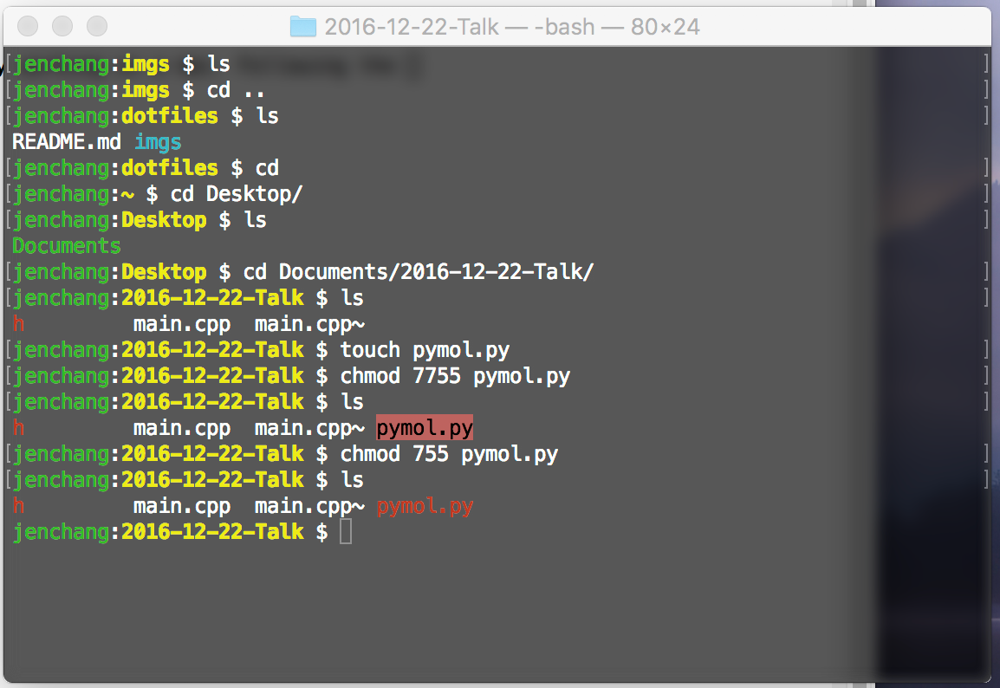

DOTFILES
--

This is my terminal setup on a Mac. I prefer having the background slightly see through.



Open **Terminal/Preferences** and add a new profile.


Then add the **.profile** to home directory in order to use settings for **username:folder prompt** and file type coloring.

```
cp .profile ~/.
```